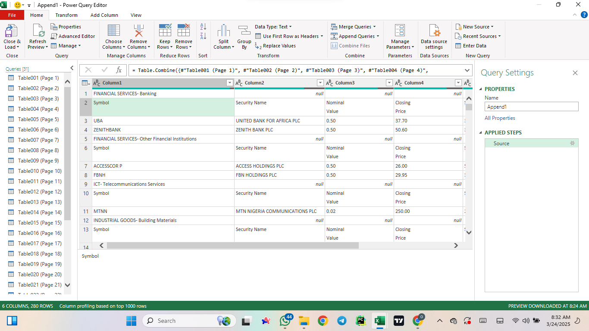
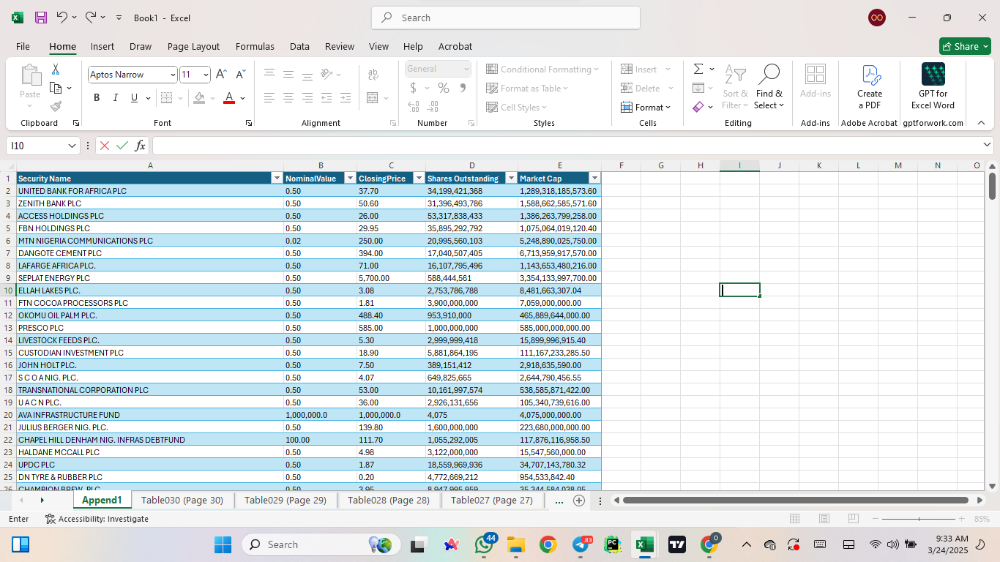
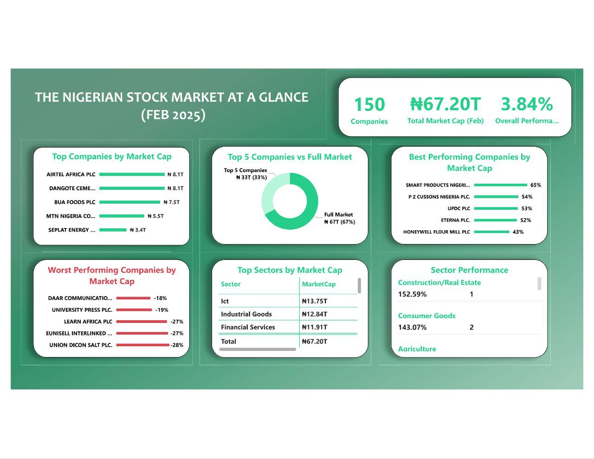

# Nigeria Stock Market Analysis (Jan - Feb 2025)

## Introduction
The Nigerian stock market serves as a dynamic mirror to the country’s evolving economic landscape and investor sentiment. In this project, I delve into the performance of the Nigerian Exchange (NGX) over the last trading days of January and February 2025. By combining robust data wrangling with insightful Power BI visualizations and DAX computations, I unravel the story behind market capitalization shifts, sector performance, and the fortunes of individual companies. This analysis not only quantifies change but also explains the possible catalysts behind these market movements.

## Problem Statement
For investors, policymakers, and analysts, understanding the intricacies of stock market movements is paramount. This study aims to:
- Identify the **top companies by market capitalization** in February 2025.
- Determine the **best and worst-performing stocks** based on percentage changes in market cap.
- Analyze **sectoral performance** and compute each sector’s share of the total market cap.
- Provide actionable insights and tell the underlying story of why these trends are emerging.

## Tools Used
- **Microsoft Excel**: For initial data cleaning, transformations, and pivot table analysis.
- **Power Query**: For extracting data from PDF reports and preprocessing datasets.
- **Power BI**: For creating interactive dashboards that bring the data story to life.
- **DAX**: To compute advanced measures and insights from the data.

## Skills Demonstrated
- **Data Cleaning & Preprocessing**: Handling messy data, eliminating redundancies, and converting data types.
- **Data Analysis & Transformation**: Merging datasets, computing percentage changes, and deriving new insights.
- **Data Visualization & Reporting**: Crafting interactive dashboards that are both informative and visually appealing.
- **DAX Formulas & Measures**: Creating custom measures that power the analytical insights.
- **Narrative Data Storytelling**: Explaining complex market dynamics with clarity and depth.

## Data Preparation

### Initial Dataset in Power Query (Before Cleaning)

*The raw data extracted from the NGX PDF reports, featuring multiple tables and unstructured headers.*

### Data Cleaning Process
1. **Removed Unnecessary Columns**: Eliminated columns like Nominal Value and Shares Outstanding that did not contribute to the analysis.
2. **Standardized Column Headers**: Reformatted headers for consistency and clarity.
3. **Converted Data Types**: Ensured numerical columns were in the correct format for accurate calculations.
4. **Merged January & February Data**: Utilized XLOOKUP and TRIM functions in Excel to create a unified dataset.
5. **Computed Percentage Changes**: Calculated changes in market capitalization and closing prices between the two periods.

### Cleaned Dataset (Final View in Excel)

*The final cleaned dataset is streamlined for analysis, with 151 rows of high-quality data ready to power our insights.*

## Data Visualization

### Stock Market Analysis Dashboard

*An interactive Power BI dashboard that visualizes the key trends in market capitalization, sector performance, and stock performance.*

## **Dashboard Breakdown: Telling the Story of Nigeria’s Stock Market**

This Power BI dashboard transforms raw market data into a **clear and compelling narrative** about Nigeria’s stock market movements between January and February 2025. It’s not just about numbers—it’s about understanding **where money is flowing, which sectors are booming, and what this means for investors**.

### **1. Top Companies by Market Cap: The Titans of the Market**
The Nigerian stock exchange is dominated by a few powerful players, and this section highlights **the biggest names shaping the market**. 

- **Airtel Africa’s dominance** stands out, surpassing even MTN Nigeria in valuation. 
- This signals a shift in investor sentiment—perhaps reflecting **Nigeria’s increasing demand for mobile connectivity and digital services**.
- The rankings show who controls the most capital and which companies have the greatest influence on market trends.

This insight is crucial for investors looking to **identify stable giants** or understand which companies are attracting the most institutional attention.

---

### **2. Top 5 Companies vs Full Market: How Concentrated is the Market?**
- The top **five companies alone hold 33% of the entire market capitalization**.
- This reveals a **highly concentrated market**, meaning a handful of firms wield **massive influence** over the entire exchange.
- If these companies perform well, the **entire market may rise**—but if they struggle, their losses could drag the index down.

This visualization helps investors gauge **how much power is in the hands of a few players** and whether they should diversify beyond the market leaders.

---

### **3. Top Performing Companies: The Market’s Rising Stars**
- This section highlights the companies that saw the **biggest increase in market capitalization**—whether in absolute value or percentage growth.
- Companies with strong performance often signal **positive investor sentiment, solid fundamentals, or recent strategic wins**.
- For example, **Smart Products Nigeria PLC surged by 65%**, suggesting that:
  - The company might have launched **a game-changing product**.
  - It could be expanding into **new, lucrative markets**.
  - There’s a potential **industry shift driving demand** for its services.

By identifying the **fastest-growing firms**, investors can spot **potential breakout opportunities**.

---

### **4. Worst Performing Companies: The Market’s Red Flags**
Just as some companies surge, others **struggle to stay afloat**. 

- This section highlights firms that saw the **biggest drops in market capitalization**.
- A stock losing value **doesn’t always mean a company is doomed**, but it signals **potential issues that require further investigation**.
- **Union Dicon Salt Plc’s decline (-28%)**, for example, raises questions:
  - Is it facing **financial difficulties or mismanagement?**
  - Did it make **a poor business decision that caused investors to pull out?**
  - Is its industry experiencing **a downturn?**

Investors and analysts can use this insight to **avoid risky investments** or spot **undervalued stocks with rebound potential**.

---

### **5. Top Sectors by Market Cap: Where the Big Money Is**
- This visualization gives a **bird’s-eye view** of which industries hold the most market value.
- Some sectors—like **telecom, banking, and oil & gas**—traditionally dominate, but this section **helps track shifts in leadership**.
- If a sector’s market cap is growing, it means **more investors are pouring money into it**, making it a **hotspot for future growth**.

Understanding sector size helps investors decide **where to focus their portfolios** and see which industries **drive the economy**.

---

### **6. Sector Performance (% Change in Market Cap): The Real Movers**
- This section tracks how different industries have **grown or shrunk** over the period.
- Some sectors—like **Construction/Real Estate (+153%) and Consumer Goods (+143%)**—saw massive gains, likely fueled by:
  - **Increased urbanization and government-backed infrastructure projects.**
  - **Stronger consumer spending power**, signaling an economic recovery.

- Meanwhile, **Natural Resources (-12%)** experienced a decline, possibly due to:
  - **Commodity price fluctuations** making the sector less attractive.
  - **A global shift toward renewable energy**, affecting traditional resource investments.

This insight helps investors spot **macro-level trends** and understand **which sectors are thriving and which ones are struggling**.

---

## **The Big Picture: What This Dashboard Tells Us**
At a glance, this Power BI dashboard captures the **pulse of Nigeria’s stock market**. 

- It reveals **where investors are betting their money** and which sectors are experiencing the biggest shifts.
- It tells us **who the market leaders are**, who’s on the rise, and who’s struggling.
- Most importantly, it provides **actionable insights** for investors, analysts, and policymakers looking to navigate the market intelligently.

This dashboard isn’t just a collection of numbers—it’s a **story of how Nigeria’s economy is evolving in real-time**. 📊🔥


## Key Findings

### Top Companies by Market Cap (February 2025)
| Rank | Company                              | Market Cap (₦) |
|------|--------------------------------------|----------------|
| 1    | AIRTEL Africa PLC                    | 8.11T          |
| 2    | Dangote Cement PLC                   | 8.10T          |
| 3    | BUA Foods PLC                        | 7.52T          |
| 4    | MTN Nigeria Communications PLC       | 5.55T          |
| 5    | Seplat Energy PLC                    | 3.60T          |

### Top Gainers (By % Market Cap Increase)
| Rank | Company                          | % Change |
|------|----------------------------------|----------|
| 1    | Smart Products Nigeria PLC       | +65%     |
| 2    | PZ Cussons Nigeria               | +54%     |
| 3    | UPDC PLC                         | +53%     |
| 4    | ETERNA PLC                       | +52%     |
| 5    | HONEYWELL FLOUR MILL PLC         | +43%     |

### Worst Performing Companies (By % Market Cap Decrease)
| Rank | Company                           | % Change |
|------|-----------------------------------|----------|
| 1    | Union Dicon Salt Plc              | -28%     |
| 2    | Eunisell Interlinked Plc          | -27%     |
| 3    | Learn Africa Plc                  | -27%     |
| 3    | University Press Plc              | -19%     |
| 3    | DAAR Communications Plc           | -18%     |

### Sector Performance (% Change in Market Cap)
| Rank | Sector                   | % Change in Market Cap |
|------|--------------------------|-----------------------|
| 1    | Construction/Real Estate | 153%                  |
| 2    | Consumer Goods         | 143%                  |
| 3    | Agriculture            | 88%                   |
| 4    | Industrial Goods       | 72%                   |
| 5    | Financial Services     | 59%                   |
| 6    | Oil And Gas            | 37%                   |
| 7    | Investment             | 18%                   |
| 8    | Conglomerates          | 18%                   |
| 9    | ICT                    | 14%                   |
| 10   | Utilities              | 4%                    |
| 11   | Healthcare             | 2%                    |
| 12   | Services               | 0%                    |
| 13   | Natural Resources      | -12%                  |

### Sector Market Capitalization (February 2025)
| Rank | Sector                   | Market Cap (NGN)    | Market Share (%) |
|------|--------------------------|---------------------|------------------|
| 1    | ICT                      | 13,747,454,685,716  | 21.6%            |
| 2    | Industrial Goods         | 12,841,626,535,794  | 20.2%            |
| 3    | Financial Services       | 11,912,958,308,314  | 18.7%            |
| 4    | Consumer Goods           | 11,685,867,393,974  | 18.4%            |
| 5    | Oil And Gas              | 7,006,242,470,848   | 11.0%            |
| 6    | Utilities                | 5,611,750,000,000   | 8.8%             |
| 7    | Services                 | 1,593,969,450,966   | 2.5%             |
| 8    | Agriculture              | 1,342,886,063,397   | 2.1%             |
| 9    | Conglomerates            | 805,474,222,312     | 1.3%             |
| 10   | Construction/Real Estate | 434,830,693,834     | 0.7%             |
| 11   | Healthcare               | 127,058,555,591     | 0.2%             |
| 12   | Investment               | 66,382,892,840      | 0.1%             |
| 13   | Natural Resources        | 25,441,434,199      | 0.0%             |

**_Image Placeholder: Sector Market Share Pie Chart_**  


## DAX Measures Used
```DAX
Companies = 
VAR TotalCount = COUNTROWS('Full Sheet')
RETURN 
    IF(TotalCount > 1, TotalCount, TotalCount)

Overall Performance % = 
VAR MarketCapJan = SUM('Full Sheet'[Market Cap(Jan)])
VAR MarketCapFeb = SUM('Full Sheet'[MarketCap(Feb)])
RETURN 
    DIVIDE(MarketCapFeb - MarketCapJan, MarketCapJan, 0)

Total Market Cap (Feb) = SUM('Full Sheet'[MarketCap(Feb)])

MarketCap_Formatted = 
SWITCH(
    TRUE(),
    SUM('TopSectors'[Sum of MarketCap(Feb)]) >= 1000000000000, "₦" & FORMAT(SUM('TopSectors'[Sum of MarketCap(Feb)]) / 1000000000000, "0.00") & "T",
    SUM('TopSectors'[Sum of MarketCap(Feb)]) >= 1000000000, "₦" & FORMAT(SUM('TopSectors'[Sum of MarketCap(Feb)]) / 1000000000, "0.00") & "B",
    "₦" & FORMAT(SUM('TopSectors'[Sum of MarketCap(Feb)]), "0.00")
)

MarketCap_Sort = SUM('TopSectors'[Sum of MarketCap(Feb)])
```

# 📊 Nigeria Stock Market Analysis (Jan - Feb 2025)

## 🔍 Key Insights

### 1️⃣ **Airtel Africa Emerges as the Most Valuable Company**
- **Airtel Africa PLC (₦8.11T) overtook MTN Nigeria (₦5.55T)** as the largest telecom company by market cap.  
- The **top five companies by market cap** in February 2025 were:  
  1. **Airtel Africa PLC** – ₦8.11T  
  2. **Dangote Cement PLC** – ₦8.10T  
  3. **BUA Foods PLC** – ₦7.52T  
  4. **MTN Nigeria Communications PLC** – ₦5.55T  
  5. **Seplat Energy PLC** – ₦3.60T  

### 2️⃣ **Smart Products Nigeria PLC Led Market Gains (+65%)**
- **Top gainer:** Smart Products Nigeria PLC saw a **+65% surge**, signaling strong investor interest.  
- **Other major gainers:** PZ Cussons Nigeria (+54%), UPDC PLC (+53%), and Eterna PLC (+52%).  
- These stocks may have been driven by **positive earnings, corporate actions, or sector growth**.  

### 3️⃣ **Union Dicon Salt PLC Had the Largest Market Cap Drop (-28%)**
- **Union Dicon Salt PLC lost 28% of its market value**, making it the worst-performing stock.  
- **Other major losers:** Eunisell Interlinked PLC (-27%), Learn Africa PLC (-27%), and University Press PLC (-19%).  
- Declines in these stocks suggest **poor earnings, regulatory issues, or investor sell-offs**.  

### 4️⃣ **Construction and Consumer Goods Were the Best-Performing Sectors**
- **Sector market cap growth:**  
  - **Construction/Real Estate**: **+153%**  
  - **Consumer Goods**: **+143%**  
  - **Agriculture**: **+88%**  
  - **Industrial Goods**: **+72%**  
- The **Financial Services sector grew by 59%**, while **ICT (14%) and Healthcare (2%) lagged behind**.  
- **Natural Resources (-12%) was the only sector that declined**, indicating **weak investor confidence**.  

### 5️⃣ **Market Trends Indicate Changing Investment Focus**
- Investors are favoring **construction, consumer goods, and industrial stocks**, possibly due to **infrastructure spending and increased consumer demand**.  
- **Financial services remain strong**, while **ICT and healthcare sectors underperformed expectations**.  

---

## 🎯 **Actionable Insights**
✅ **Focus on high-growth sectors**: Construction, consumer goods, and industrial goods show strong momentum.  
✅ **Investigate declining sectors**: Natural resources and services may be facing structural challenges.  
✅ **Company-Specific Research**: Explore the fundamentals behind **Smart Products Nigeria PLC’s rise and Union Dicon Salt PLC’s drop**.  
✅ **Macroeconomic Analysis**: Examine how **CBN policies, inflation, and fiscal measures** influenced investor sentiment.  


### Author
**Owadokun Oluwatobi Ezekiel**  

This report showcases my expertise in **data analysis, Power BI reporting, and stock market insights**. By leveraging advanced data wrangling techniques, I have transformed raw data into a professional and impactful stock market analysis. 🚀
